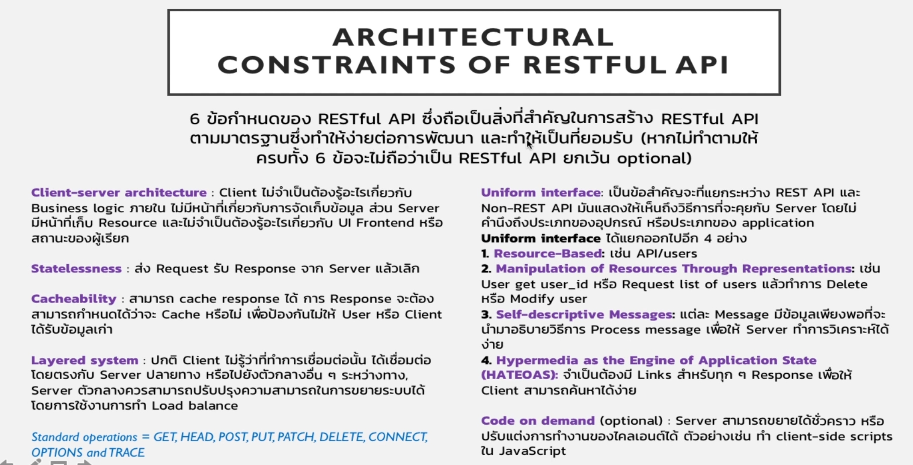

```js
const express = require('express');

const app = express();

const PORT = 3000;

const friends = [
  { id: 0, name: 'Albert Einstein' },
  { id: 1, name: 'Sir Isaak Newton' },
];

app.use((req, res, next) => {
  const start = Date.now(); // represents start time
  next(); // call next middleware to pass control to next handler
  const delta = Date.now() - start; // represents difference in times between start and after process in done
  console.log(`${req.method} ${req.url} ${delta}ms`);
});

app.get('/friends', (req, res) => {
  res.json(friends);
});

// GET /friends/22
app.get('/friends/:friendId', (req, res) => {
  const friendId = Number(req.params.friendId);
  const friend = friends[friendId];
  if (friend) {
    res.status(200).json(friend);
  } else {
    res.status(404).json({ error: 'Friend does not exist' });
  }
});

app.get('/message', (req, res) => {
  res.send('<ul><li>Helloo Albert</li></ul>');
});

app.listen(PORT, () => {
  console.log(`Server running on port ${PORT}`);
});
```

```js
app.use((req, res, next) => {...})
```

- app.use() : returns a middleware function (next) that can be used to pass control to the next middleware function in the stack. you can chian multiple middleware functions.

```js
app.get((req, res) => {...})
```

- app.METHOD : is middleware endpoint that returns a function that can be used to send a response to the client.(no next middleware )

# POST Request in Express

```js
const express = require('express');

const app = express();

const PORT = 3000;

const friends = [
  { id: 0, name: 'Albert Einstein' },
  { id: 1, name: 'Sir Isaak Newton' },
];

app.use((req, res, next) => {
  const start = Date.now(); // represents start time
  next(); // call next middleware to pass control to next handler
  const delta = Date.now() - start; // represents difference in times between start and after process in done
  console.log(`${req.method} ${req.url} ${delta}ms`);
});

app.use(express.json()); // return pice of middleware and converts req.body from json to be an js object

app.post('/friends', (req, res) => {
  if (!req.body.name) {
    return res.status(400).json({ error: 'Missing friend name' }); // return status code and json when no name passed
  }
  const newFriend = {
    name: req.body.name,
    id: friends.length,
  };
  friends.push(newFriend);

  res.json(newFriend); // respond back with newFriend
});

app.get('/friends', (req, res) => {
  res.json(friends);
});

// GET /friends/22
app.get('/friends/:friendId', (req, res) => {
  const friendId = Number(req.params.friendId);
  const friend = friends[friendId];
  if (friend) {
    res.status(200).json(friend);
  } else {
    res.status(404).json({ error: 'Friend does not exist' });
  }
});

app.get('/message', (req, res) => {
  res.send('<ul><li>Helloo Albert</li></ul>');
});

app.listen(PORT, () => {
  console.log(`Server running on port ${PORT}`);
});
```

# Model View Controller (MVC)

**note**: when we are defining a function at the top level of the file and not passing it in as an argument to a function, it's usually a good idea to function declaration.

because when we are debugging our node app and we get one of those error messages, node can tell us the name of the function where something went wrong in a log

function declaration:

```js
function functionName(parameters) {
  // code to be executed
}
```

```js
// ./server.js
const express = require('express');
// use named import for controller just once and can use it anywhere
const messagesController = require('./controllers/messages.controller');
const friendsController = require('./controllers/friends.controller');

const app = express();

const PORT = 3000;

app.use((req, res, next) => {
  const start = Date.now(); // represents start time
  next(); // call next middleware to pass control to next handler
  const delta = Date.now() - start; // represents difference in times between start and after process in done
  console.log(`${req.method} ${req.url} ${delta}ms`);
});

app.use(express.json()); // return pice of middleware and converts req.body from json to be an js object

app.post('/friends', friendsController.postFriend);
app.get('/friends', friendsController.getFriends);
app.get('/friends/:friendId', friendsController.getFriend); // GET /friends/1

app.get('/messages', messagesController.getMessages);
app.post('/messages', messagesController.postMessages);

app.listen(PORT, () => {
  console.log(`Server running on port ${PORT}`);
});
```

```js
// ./models/friends.model.js
const friends = [
  { id: 0, name: 'Albert Einstein' },
  { id: 1, name: 'Sir Isaak Newton' },
];

module.exports = friends;
```

```js
// ./controllers/messages.controller.js
function getMessages(req, res) {
  res.send('<ul><li>Helloo Albert</li></ul>');
}

function postMessages(req, res) {
  console.log('Updating messages...');
}

module.exports = {
  getMessages,
  postMessages,
};
```

```js
// ./controllers/friends.controller.js
const model = require('../models/friends.model');

function postFriend(req, res) {
  const { name } = req.body;
  if (!name) {
    return res.status(400).json({ error: 'Missing friend name' });
  }

  const newFriend = { id: model.length, name };
  model.push(newFriend);
  res.status(201).json({ id: model.length - 1, name });
}

function getFriends(req, res) {
  res.json(model);
}

function getFriend(req, res) {
  const friendId = Number(req.params.friendId);
  const friend = model[friendId];
  if (friend) {
    res.status(200).json(friend);
  } else {
    res.status(404).json({ error: 'Friend does not exist' });
  }
}

module.exports = { postFriend, getFriends, getFriend };
```

# Express Router

```js
// ./server.js
const express = require('express');

const frindsRouter = require('./routes/friends.router');
const messagesRouter = require('./routes/messages.router');

const app = express();

const PORT = 3000;

app.use((req, res, next) => {
  const start = Date.now();
  next();
  const delta = Date.now() - start;
  console.log(`${req.method} ${req.baseUrl}${req.url} ${delta}ms`);
});

app.use(express.json());

app.use('/friends', frindsRouter); // use router as middleware (mountilng the messages router)
app.use('/messages', messagesRouter); // use router as middleware (mountilng the messages router)

app.listen(PORT, () => {
  console.log(`Server running on port ${PORT}`);
});
```

**Note:**

````js
console.log(`${req.method} ${req.baseUrl}${req.url} ${delta}ms`);```
````

output is:

```sh
GET /friends/ 12ms
```

or

```sh
GET /messages/ 12ms
```

```js
// ./routes/friends.router.js
const express = require('express');
const friendsController = require('../controllers/friends.controller');

const frindsRouter = express.Router(); // create router

// add middleware
frindsRouter.use((req, res, next) => {
  console.log('ip address: ', req.ip);
  next();
});

frindsRouter.post('/', friendsController.postFriend);
frindsRouter.get('/', friendsController.getFriends);
frindsRouter.get('/:friendId', friendsController.getFriend);

module.exports = frindsRouter;
```

**Note:**

```js
console.log('ip address: ', req.ip);
```

output is:

```sh
ip address: ::1
```

- ::1 is an IPv6 address (localhost)
- 127.0.0.1 is an IPv4 address

```js
// ./routes/messages.router.js
const express = require('express');

const messagesController = require('../controllers/messages.controller');

const messagesRouter = express.Router();

messagesRouter.get('/', messagesController.getMessages);
messagesRouter.post('/', messagesController.postMessages);

module.exports = messagesRouter;
```

# RESTful APIs

## RESTful API rules 6




[referance 👉](https://www.restapitutorial.com/lessons/httpmethods.html)

### path build in module

**Certainly! In Node.js, the path module is a built-in module that provides utilities for working with file and directory paths. It helps in constructing and manipulating file paths in a way that is platform-independent (i.e., it works consistently across different operating systems).**

```js
// ./controllers/messages.controller.js
const path = require('path');

function getMessages(req, res) {
  res.sendFile(
    path.join(__dirname, '..', 'public', 'images', 'skimountain.jpg')
  );
}

function postMessages(req, res) {
  console.log('Updating messages...');
}

module.exports = {
  getMessages,
  postMessages,
};
```

**Note:**

```js
res.sendFile(path.join(__dirname, '..', 'public', 'skimountain.jpg'));
```

- **res.sendFileres(...)** send a file to the client
- **\_\_dirname** is the current directory
- **'..'** tell node to go up one level
- **'public'** is the folder name
- **'skimountain.jpg'** is the file name

# Serving Website With Node

```js
const express = require('express');
const path = require('path');

const frindsRouter = require('./routes/friends.router');
const messagesRouter = require('./routes/messages.router');

const app = express();

const PORT = 3000;

app.use((req, res, next) => {
  const start = Date.now();
  next();
  const delta = Date.now() - start;
  console.log(`${req.method} ${req.baseUrl}${req.url} ${delta}ms`);
});

app.use('/site', express.static(path.join(__dirname, 'public')));
app.use(express.json());

app.use('/friends', frindsRouter); // use router as middleware (mountilng the messages router)
app.use('/messages', messagesRouter); // use router as middleware (mountilng the messages router)

app.listen(PORT, () => {
  console.log(`Server running on port ${PORT}`);
});
```

**Note:**

```js
app.use('/site', express.static(path.join(__dirname, 'public')));
```

- **express.static(path)** use for serving static website like html+css, react, vue, Angular
- **'public'** means response everything from the public folder

# Templating Engine

[Templating Engine Support](https://expressjs.com/en/resources/template-engines.html)

one of the most widely use is **hbs**

- hbs: Adapter for Handlebars.js, an extension of Mustache.js template engine
- Handlebars.js is a more modern templating engine base on the older Mustache.js template engine
- Handlebars which uses {{title}} as placeholder for variables
- when run express server the tempolate engine will replace these variables maked with {{}} with their actual values that comes from the node server, and it transfrom that document, which we call a template into an HTML file to be rendered by the browser, so it allows us to populate our HTML with data before it's sent to the client to be shown to the user
- to use one of these template engine, we need to install the corrasponding npm package, for example:

```sh
npm install hbs --save
```

- we don't actually need to import or require it into our node application, Express has a way of loading our new template engine internally, so we don't have to do it. we have to do is tell Express which template engine we want to use and where it can find our templates

**How to setting:** [follow this link](https://expressjs.com/en/4x/api.html#app.set)
